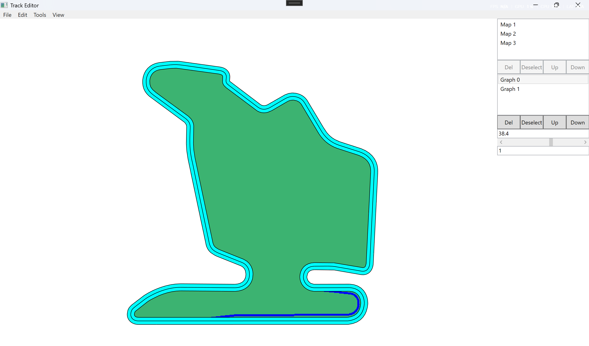

# TrackEditor
A simple WPF-based Bezier graph editor for creating, editing, rasterizing, and exporting track-like 2D layouts.

## Features
 - Edit Bezier anchors, handles, and directed segments
 - Add, insert, delete, splice, and reverse segments
 - Supports multiple graph layers, including centerlines, boundaries, and pit lanes
 - Undo / redo command system
 - Rasterize Bezier curves into grid cells
 - Export full images or selected layers
 - Basic track loading and graph creation workflow

## Screenshot

*The circuit shown in the demo screenshot is [Hungaroring](https://hungaroring.hu), located in Mogyoród, Pest County, Hungary.*

## Usage
 - Use Anchor Edit mode to add, move, insert, or delete anchors.
 - Use Segment Edit mode to select, delete, or reverse segments.
 - Use layer controls to switch between graphs/images.
 - Use rasterization/export commands to generate image outputs.

## Project Structure
 - `Graph/` - Bezier graph model, references, commands, undoable transforms
 - `Controls/` - reusable canvas and selection controls
 - `SpecificControls/` - graph-aware editor controls
 - `Rasterization/` - curve-to-grid rasterization logic
 - `TrackEditor/` - WPF application shell and commands

## Requirements
 - Windows
 - .NET 10 or later

 ## Notes
 This project is currently a personal editor prototype. Some UI labels and workflows are still being refined, but the core graph editing, command system, rasterization, and export workflows are functional.

 ## Acknowledgements
 This project uses the following open-source libraries:
 - [Newtonsoft.Json](https://www.newtonsoft.com/json) - JSON parsing and serialization
 - [Extended.Wpf.Toolkit](https://github.com/xceedsoftware/wpftoolkit) - Color selection control